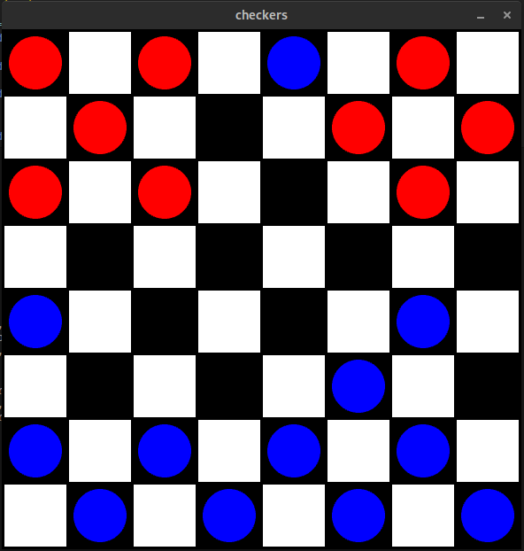

# Checkers

Implementation of a checkers game in python and arcade [**work in progress**]

<p align="center">
	<a href="">
		
	</a>
</p>

## How to run

Create a virtual env:

```bash
$ mkvirtualenv --python=python3.6 checkers
```

If you already have the environment:

```bash
$ workon checkers
```

Install all dependencies: 

```bash
$ pip install -r requirements.txt
```

Run:

```bash
$ python src/checkers.py
```

Tests:
```bash
$ pytest
```

## Author

* **Rafael Coelho** - [rafaellcoellho](https://github.com/rafaellcoellho)

## Reference 

+ [international checkers rules](https://en.wikipedia.org/wiki/International_draughts)
+ [implementation of parker knight](https://www.youtube.com/watch?v=PWl2LBISMug)
